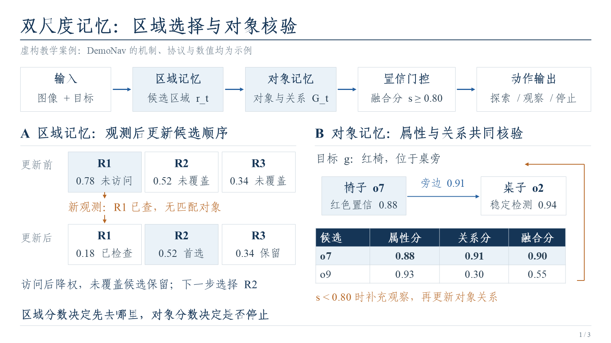
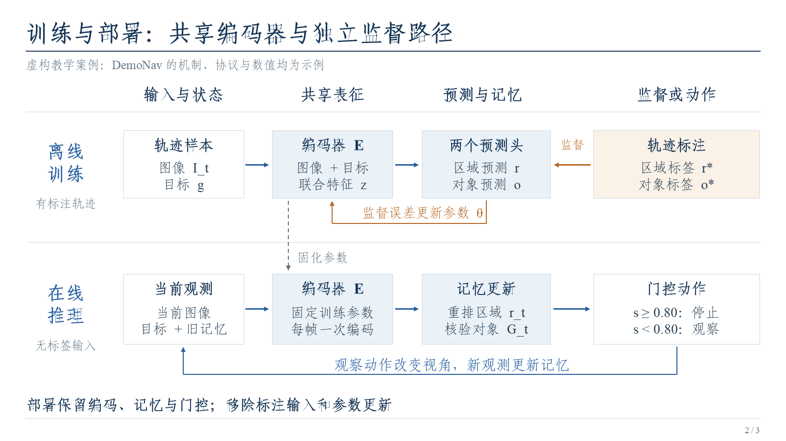
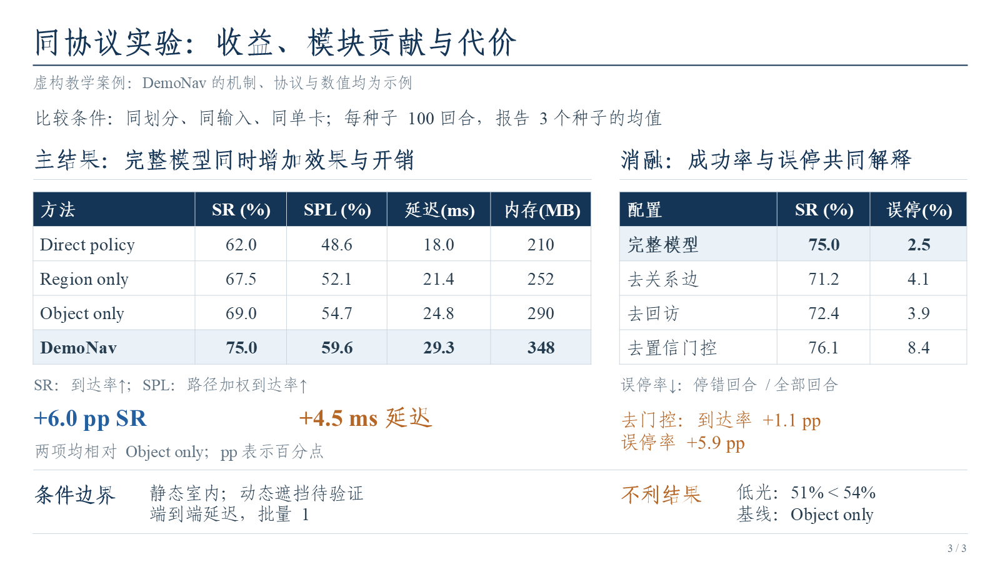

<div align="center">

# 🧵 PaperLoom · 论文织图

### De l’article scientifique à une présentation claire et visuelle.

**6–8 diapositives par défaut · Preuves regroupées · Figures d’origine · Équations natives · PPTX modifiable**


[🚀 Démarrage rapide](#quick-start) · [🖼️ Aperçu](#preview) · [🧭 Structure des diapositives](#workflow) · [🛠️ Développement](#development) · [📚 Guides](#guides)

</div>

<p align="center">
<a href="../../README.md"></a>
  <a href="README_ZH.md"></a>
  <a href="README_ZH_HK.md"></a>
  <a href="README_JA.md"></a>
  <a href="README_FR.md"></a>
  <a href="README_RU.md"></a>
  <a href="README_DE.md"></a>
</p>

---

PaperLoom transforme des articles scientifiques en présentations **PowerPoint `.pptx`** compactes, modifiables et centrées sur les figures et les graphiques. Installez le skill dans un client compatible, ou téléversez le projet complet au format ZIP avec l’article dans un GPT web capable d’exécuter du code.

<a id="features"></a>

## ✨ Fonctionnalités

<table>
  <tr>
    <td width="50%" valign="top"><strong>🎨 Un récit visuel</strong><br>Les figures expliquent les entrées, les états, les transformations et les retours. Les preuves liées partagent une page ; les expériences conservent des tableaux natifs et les résultats défavorables.</td>
    <td width="50%" valign="top"><strong>🖼️ Les figures d’origine</strong><br>Extraction directe des images intégrées au PDF : aucune capture de page ni capture recadrée présentée comme une image extraite.</td>
  </tr>
  <tr>
    <td width="50%" valign="top"><strong>🧮 Des équations modifiables</strong><br>Conversion des équations nécessaires de LaTeX vers le format Office Math natif de PowerPoint, pour qu’elles restent modifiables.</td>
    <td width="50%" valign="top"><strong>🔤 Des polices vérifiables</strong><br>FangSong GB2312 (仿宋 GB2312) pour le chinois, Times New Roman pour l’anglais et les chiffres. Les fichiers, leurs propriétés et leurs empreintes de hachage sont vérifiables.</td>
  </tr>
  <tr>
    <td width="50%" valign="top"><strong>🔎 Des preuves dans les notes</strong><br>Sources détaillées et explications longues dans les notes. Indicateurs, unités, conditions de comparaison et limites importantes restent près des figures et tableaux ; le pied de page reste discret.</td>
    <td width="50%" valign="top"><strong>🛠️ Des révisions ciblées</strong><br>Les modifications préservent les autres diapositives, polices, équations et paramètres de compatibilité déjà validés.</td>
  </tr>
</table>

<a id="preview"></a>

## 🖼️ Aperçu

Cette démonstration utilise des **données fictives** clairement signalées ; elle ne représente pas les conclusions d’un véritable article.

<table>
  <tr>
    <th width="33%">Mécanismes et états</th>
    <th width="33%">Entraînement et inférence</th>
    <th width="33%">Résultats et limites</th>
  </tr>
  <tr>
    <td><a href="../../examples/evidence-demo/preview-01.png"></a></td>
    <td><a href="../../examples/evidence-demo/preview-02.png"></a></td>
    <td><a href="../../examples/evidence-demo/preview-03.png"></a></td>
  </tr>
</table>

[📥 Présentation PPTX modifiable](../../examples/evidence-demo/evidence-demo.pptx) · [📖 Code source et commandes de reproduction](../../examples/evidence-demo/README.md)

<a id="quick-start"></a>

## 🚀 Démarrage rapide

### 💻 Client local

Clonez ou téléchargez ce dépôt avec les polices incluses, consultez le [guide des polices](../../fonts/README.md), puis exécutez la commande suivante à la racine du dépôt :

```bash
python scripts/install_skill.py
```

Par défaut, le skill est copié dans `~/.agents/skills/paper-loom/` pour l’utilisateur courant. Si ce répertoire existe déjà, l’installation s’arrête sans écraser votre version. Vous pouvez aussi sélectionner directement ce dossier complet dans un client prenant en charge l’importation de skills. [Guide détaillé pour les clients](../../references/client-mode.md)

Après l’installation, sélectionnez PaperLoom dans le client ou saisissez :

```text
Utilise $paper-loom pour transformer cet article en une présentation PowerPoint pour une
réunion de laboratoire.
Respecte les exigences du skill concernant la structure, les polices, l’extraction des
images et les équations natives, puis livre directement le fichier .pptx.
```

### 🌐 Téléversement sur le web

Utilisez de préférence l’archive publiée **`paper-loom-v1.1.0-full.zip`** et téléversez-la avec le PDF de l’article. Pour partir du code source, créez l’archive avec la commande `package_skill.py --variant full` indiquée plus bas ; elle exclut les fichiers de construction et les caches privés. Envoyez ensuite :

```text
Décompresse PaperLoom et suis le processus de WEB_START.md pour créer la présentation de cet article.
Lis d’abord SKILL.md, references/design.md, references/reference-patterns.md et references/quality-gates.md.
Organise les preuves, enregistre slide-plan.json, puis poursuis directement la création.
Prévois 6–8 diapositives par défaut, ou 8–10 pour un article complexe. N’ajoute pas de page de revue
bibliographique ou d’équations uniquement pour atteindre un nombre de pages.
Explique les mécanismes et les preuves liés sur une même page. Garde les conditions de comparaison,
les unités et les résultats défavorables. Respecte les polices, l’extraction des figures et les équations
natives nécessaires. Place les sources détaillées et les longues explications dans les notes.
Vérifie la structure et la qualité, rends et inspecte chaque diapositive, corrige les défauts, puis livre un .pptx téléchargeable.
```

> [!NOTE]
> Le GPT web doit pouvoir décompresser des archives, exécuter du code et produire des fichiers téléchargeables. Téléverser le ZIP ne lui fournit pas ces outils et n’installe pas le skill de façon permanente. Les instructions complètes se trouvent dans [WEB_START.md](../../WEB_START.md).

<a id="workflow"></a>

## 🧭 Une structure guidée par les preuves

Comptez **6–8 diapositives** par défaut, ou **8–10** pour un article complexe. Le nombre et le modèle demandés par l’utilisateur priment. Couvrez la tâche et son positionnement, les mécanismes, l’entraînement et l’exécution, les expériences et leurs limites, puis la synthèse. Ces éléments ne nécessitent pas chacun une page séparée. Une revue bibliographique autonome et un nombre fixe de pages de méthode ne sont pas obligatoires.

Avant de créer les diapositives, lisez les guides de [conception](../../references/design.md), de [compositions et contre-exemples](../../references/reference-patterns.md) et de [contrôle qualité](../../references/quality-gates.md). Préparez `slide-plan.json` dans le dossier de travail à partir du [modèle de plan](../../examples/slide-plan.template.json), puis continuez sans attendre par défaut une approbation du plan.

Regroupez la vue d’ensemble, les états intermédiaires et les conditions de retour d’un même mécanisme. Rapprochez les résultats principaux à protocole identique, les ablations et les résultats défavorables. Gardez les conditions près des figures et tableaux, les explications longues et sources détaillées dans les notes. Utilisez la [démonstration centrée sur les preuves](../../examples/evidence-demo/README.md) comme référence visuelle et vérifiez la lisibilité de chaque page.

<details>
<summary><b>Les étapes de la méthode de travail</b></summary>

Le récit ci-dessous décrit l’ancien cas GeoNav. Son nombre fixe de pages et sa revue en six blocs ne constituent plus les exigences par défaut.

Ce skill est né de plusieurs cycles de création et de révision d’une présentation de GeoNav pour une réunion de laboratoire : condensation du contenu, ajustement du fil narratif, gestion des polices et des équations natives, correction du format Office, suppression des annotations en pied de page et remplacement d’un grand tableau de synthèse bibliographique par six blocs d’axes de recherche. Il transforme ces méthodes éprouvées en instructions et scripts réutilisables.

1. **Définir les objectifs de la réunion et les critères visuels** : véritable PPTX, contenu compact et dense, priorité aux figures et graphiques, polices imposées et équations natives.
2. **Lire l’article et constituer un index des preuves** : relier les conclusions, les figures et tableaux, les protocoles et définitions des expériences, les cas d’échec et les limites d’interprétation.
3. **Organiser les preuves avant les pages** : relier la tâche, les mécanismes, les expériences et les limites dans le plan ; regrouper les pages qui dépendent de la même figure ou du même mécanisme si elles restent lisibles.
4. **Traiter les ressources d’origine et les objets modifiables** : extraire directement les images, créer des tableaux et graphiques natifs, convertir le LaTeX en Office Math et appliquer les polices à chaque segment de texte (`run`).
5. **Vérifier le contenu, la mise en page et la compatibilité** : rendre chaque diapositive, comparer les données et remplacer la valeur non conforme `charset=134` de GB2312 par `-122`.
6. **Procéder à des révisions ciblées selon les retours** : conserver les sources détaillées dans les notes et les conditions utiles près des figures, tout en protégeant les pages validées et les corrections de format.

Le déroulement complet est présenté dans le [retour d’expérience GeoNav](../../examples/geonav/workflow.md).

</details>

<a id="development"></a>

## 🛠️ Développement et validation

Utilisez Python 3.10+ et Node.js 20+. Exécutez les commandes suivantes à la racine du dépôt :

```bash
python -m pip install -r requirements.txt
npm install
python scripts/doctor.py
```

La conversion en équations natives nécessite également `pandoc` : suivez la [documentation officielle de Pandoc](https://pandoc.org/installing.html). Les polices requises sont incluses dans `fonts/` ; consultez le [guide des polices](../../fonts/README.md) pour les modalités d’utilisation. Si l’environnement dispose déjà d’un outil dédié à PowerPoint, il n’est pas nécessaire d’en changer.

<details>
<summary><b>🖼️ Extraire les images</b></summary>

```bash
python scripts/extract_pdf_assets.py paper.pdf --output work/paper-assets
```

La sortie contient les ressources d’origine et un manifeste. L’option `--pages 1,3-5` est prise en charge. Un objet intégré peut ne représenter qu’une partie d’une figure : il faut vérifier que la figure reste complète sur le plan sémantique. Les figures purement vectorielles ou comportant du texte superposé ne doivent pas être automatiquement remplacées par des captures d’écran. [Guide d’extraction des images](../../references/figure-extraction.md)

</details>

<details>
<summary><b>🧮 Équations, polices et validation</b></summary>

Dans le PPTX natif, réservez un paragraphe distinct pour chaque équation nécessaire, par exemple `[[EQ_FUSION]]`, et indiquez le LaTeX correspondant dans le fichier de correspondance :

```bash
python scripts/inject_equations.py draft.pptx math.pptx --mapping equations.json --require-all
python scripts/embed_fonts.py math.pptx final.pptx
python scripts/validate_pptx.py final.pptx --expected-slides 8 --expected-math 3 --report validation.json
```

Les `8` diapositives et les `3` équations correspondent aux exigences de cet exemple GeoNav ; adaptez-les à chaque nouvel article. Si un article n’a pas besoin d’équations, il n’est pas nécessaire d’en ajouter pour atteindre un nombre donné. L’incorporation des polices doit respecter leurs licences ; par défaut, les cinq fichiers de `fonts/` sont incorporés.

Le validateur vérifie notamment la structure du paquet, les relations, les jeux de caractères des polices, les équations natives et les espaces réservés, mais **il ne constitue ni une validation complète du schéma OOXML, ni un test dans la version de bureau de Microsoft PowerPoint**. Après le rendu, le contenu et la mise en page doivent encore être contrôlés diapositive par diapositive. [Guide de compatibilité](../../references/powerpoint-compatibility.md)

</details>

Exécutez les tests :

```bash
python -m unittest discover -s tests -v
```

<details>
<summary><b>📦 Créer les archives de distribution</b></summary>

```bash
python scripts/package_skill.py --variant github --output ../paper-loom-v1.1.0-github.zip
python scripts/package_skill.py --variant full --output ../paper-loom-v1.1.0-full.zip
```

L’archive complète inclut les polices fournies avec le dépôt ; l’outil de création de paquets vérifie qu’elles sont toutes présentes. L’option `--variant github` crée une archive du code source sans les fichiers de polices séparés.

</details>

<a id="guides"></a>

## 📚 Guides et dépôt

- [💻 Guide détaillé pour les clients](../../references/client-mode.md)
- [🌐 Instructions pour le web](../../WEB_START.md)
- [🖼️ Guide d’extraction des images](../../references/figure-extraction.md)
- [🧩 Guide de compatibilité PowerPoint](../../references/powerpoint-compatibility.md)

<details>
<summary><b>Arborescence du dépôt</b></summary>

| Chemin | Contenu |
|---|---|
| `SKILL.md` | Flux de travail principal et exigences de qualité à lire par l’IA |
| `WEB_START.md` | Prompts à copier et instructions d’exécution pour le web |
| `README.md` | Présentation du projet en anglais |
| `docs/i18n/` | Traductions du README |
| `fonts/` | Fichiers de polices inclus, instructions d’utilisation et manifeste de vérification |
| `scripts/` | Outils d’extraction d’images, d’équations natives, d’incorporation de polices, de vérification PPTX, d’installation et de création de paquets |
| `references/` | Guides de conception des diapositives, d’extraction d’images, de compatibilité et d’utilisation dans un client |
| `examples/evidence-demo/` | Démonstration exécutable de trois diapositives avec des mises en page natives et code source de génération |
| `examples/geonav/workflow.md` | Déroulement de cette réalisation, structure finale en 8 diapositives et principales corrections |
| `examples/evidence.template.json` | Modèle pour les sources, les protocoles et définitions des expériences, et les enregistrements de validation |
| `examples/slide-plan.template.json` | Modèle des questions, preuves, visuels et décisions de regroupement par page |
| `tests/` | Tests du comportement des scripts et de non-régression |

</details>

<a id="license"></a>

## 📄 Licence

Le code et la documentation originaux du projet sont publiés sous licence [MIT](../../LICENSE). Pour les polices tierces, les articles et les dépendances, consultez [THIRD_PARTY_NOTICES.md](../../THIRD_PARTY_NOTICES.md).
