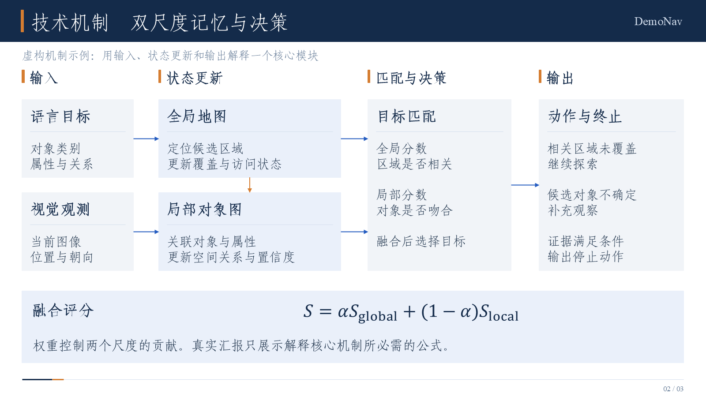
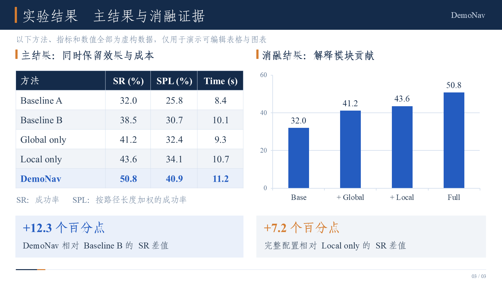

# 三页版式组件示例

这是 **PaperLoom** 的可运行示例，用来展示紧凑科研组会 PPT 中的三个组件。它不是完整论文汇报，也不代表真实研究。示例中的 **DemoNav、Method A–F 与全部实验数值均为虚构**；每页和演讲者备注都保留了这一说明。

直接打开 [layout-demo.pptx](layout-demo.pptx) 即可检查对象是否可编辑。

| 页码 | 展示的组件 | 编辑方式 |
| --- | --- | --- |
| 1 | 两行三列文献分块，下方集中显示研究定位 | 文字、分块和线条均为原生对象 |
| 2 | 输入、记忆更新、匹配决策、输出机制图 | 形状和箭头分别可编辑，融合公式为原生 Office Math |
| 3 | 主结果表与消融柱状图并列 | 表格为原生表格，图表包含可编辑的数据工作簿 |

本目录是早期原生对象与公式兼容性示例，六宫格和大流程页不再作为默认设计质量目标。新建汇报优先阅读 [紧凑证据示例](../evidence-demo/README.md) 和 [参考版式](../../references/reference-patterns.md)，按证据与可读性决定页数。

## 预览






预览图由成品 PPT 渲染，仅供浏览。PPT 本身没有使用整页图片，演示也没有使用论文截图或论文版权图。

## 本地复现

需要 Node.js 18+、Python 3.10+ 和 Pandoc。Python 依赖在仓库根目录的 `requirements.txt` 中。仓库已附带中文仿宋 GB2312 与英文字体 Times New Roman，使用说明见 [字体指南](../../fonts/README.md)；生成器会按中英文拆分文字运行，字体声明不等于字体已经安装或嵌入。

从仓库根目录执行：

```bash
npm install
python -m pip install -r requirements.txt

# 写入 build/layout-demo.draft.pptx，其中保留一处公式占位符。
npm run demo:legacy

# 转换成可编辑的原生 PowerPoint 公式，输出至新文件。
python scripts/inject_equations.py build/layout-demo.draft.pptx build/layout-demo.pptx --mapping examples/layout-demo/equations.json --font "Times New Roman"

# 检查页数、Office Math 数量、未替换占位符与关键包结构。
python scripts/validate_pptx.py build/layout-demo.pptx --expected-slides 3 --expected-math 1
```

已存在的公式输出文件不会被静默覆盖。再次运行时使用新的输出文件名，或明确删除自己不再需要的构建产物。

如需自定义草稿输出位置：

```bash
node examples/layout-demo/build.mjs --out build/my-demo.draft.pptx
```

`build.mjs` 仅依赖公开 npm 包 `pptxgenjs` 与 `jszip`，不依赖特定客户端的私有绘图服务、运行时路径或 API。它会校正本示例生成器的悬空默认母版类型声明、重复形状编号、母版列表顺序与重复段落属性；如果重复段落属性内容冲突，会停止而不盲目删除。随后仍需运行结构检查。

## 如何替换成论文内容

1. 文献页：保留分块结构，填入有出处的代表方法、机制、局限和比较边界。不要用虚构示例中的句子代替阅读论文。
2. 技术页：把箭头改成论文的真实信息流，每个模块写清输入、更新和输出。论文原图需要直接提取嵌入资源；本页的示意图不替代任何论文原图。
3. 公式：修改 `equations.json` 中的 LaTeX，保持每个占位符独占一个段落，再执行原生公式转换。不要把 LaTeX 源码或公式图片当作最终交付。
4. 实验页：替换表格与图表底层数据，重新计算差值，保留指标、单位、评测划分和公平比较条件。只有确属示例的数据才能标成“虚构”。
5. 来源：记入各页演讲者备注与证据映射文件。页脚只保留装饰线及页码。

本示例的包结构与原生公式检查可自动重复运行，也已经逐页渲染检查。自动结构检查不等于在桌面 Microsoft PowerPoint 中实际打开；正式交付时按 `SKILL.md` 的验证边界如实报告。
